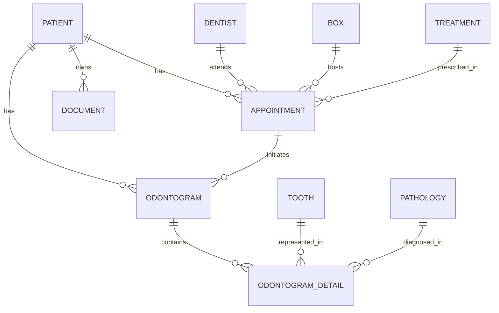

# 🦷 Odontología Backend - Sistema de Gestión Clínica

[](https://symfony.com)
[](https://php.net)
[](https://mysql.com)

Sistema avanzado para la gestión integral de clínicas dentales. Esta API proporciona una infraestructura robusta para el manejo de historiales médicos, agendas de citas y odontogramas interactivos.

---

## 🏗️ Arquitectura de la Base de Datos

El núcleo del sistema utiliza **Doctrine ORM** para gestionar un esquema relacional complejo que garantiza la integridad de los datos clínicos.



---

## 🌟 Funcionalidades Principales

### 📁 Gestión de Pacientes y Archivos
- **Ficha Clínica**: Expediente detallado con antecedentes, alergias y estado de salud.
- **Repositorio de Documentos**: Gestión de archivos adjuntos y pruebas diagnósticas.

### 📅 Agenda Inteligente
- **Control de Citas**: Gestión de estados, razones de consulta y asignación de consultorios (**Box**).
- **Asignación de Doctores**: Vinculación de especialistas por tratamiento.

### 🦷 Odontograma Especializado
- **Registro Detallado**: Seguimiento por pieza dental (**Tooth**) y patologías específicas.
- **Relación con Citas**: Cada evolución dental queda vinculada a una consulta médica.

---

## 🛠️ Stack Tecnológico Interno

| Componente | Tecnología |
| :--- | :--- |
| **Framework Core** | Symfony 7.4.x |
| **Persistencia** | Doctrine ORM 3.0 |
| **Seguridad** | Symfony Security Bundle |
| **API** | RESTful with Serializer Groups |
| **CORS** | NelmioCorsBundle |

---

## 📂 Estructura del Proyecto

```text
Odontolog-Backend/
├── config/             # Configuraciones de Symfony y servicios
├── migrations/         # Control de versiones de la base de datos
├── public/             # Punto de entrada (index.php) e imágenes
├── src/
│   ├── Controller/     # Endpoints de la API
│   ├── Entity/         # Modelos de datos (Doctrine)
│   ├── Repository/     # Lógica de consulta a base de datos
│   └── Service/        # (Opcional) Lógica de negocio
└── templates/          # Vistas (principalmente para emails/debug)
```

---

## 🚦 Guía de Inicio Rápido

### Requisitos Previos
- PHP 8.2 o superior
- Composer instalado
- Servidor MySQL/MariaDB

### Pasos de Instalación

1. **Clonación e Instalación:**
   ```bash
   git clone <repo-url>
   composer install
   ```

2. **Migración de Base de Datos:**
   Configura tu `DATABASE_URL` en el `.env` y ejecuta:
   ```bash
   php bin/console doctrine:database:create
   php bin/console doctrine:migrations:migrate
   ```

3. **Ejecución:**
   ```bash
   symfony serve
   ```

---

## 📝 Notas de Desarrollo
- El sistema utiliza **Serializer Groups** para optimizar las respuestas JSON (`patient:read`, `appointment:read`, etc.).
- Las relaciones de `OdontogramDetail` permiten un histórico granular por cada pieza dental.

---
© 2026 Gestión Dental Pro. Todos los derechos reservados.
